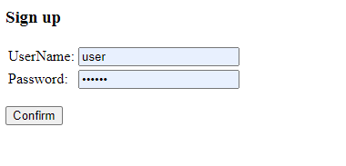

## job4j_car_accident

### Описание
Площадка для фиксации автомобильных правонарушений. Позволяет пользователям фиксировать ДТП. Правонарушения сохраняются в БД.

### Технологии
- Java
    - Spring Security
    - Spring MVC
    - Spring Data
    - Java 12
- Hibernate
- PostgreSQL 10
- JSP
- JSTL
- Apache maven
- IntelliJ IDEA

### Функциональность
#### Регистрация на форуме.

#### Авторизация для входа

#### Создание новой темы.

#### Главная страница по списком всех тем.

#### Схема базы данных

